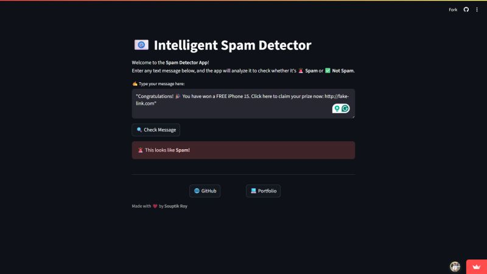
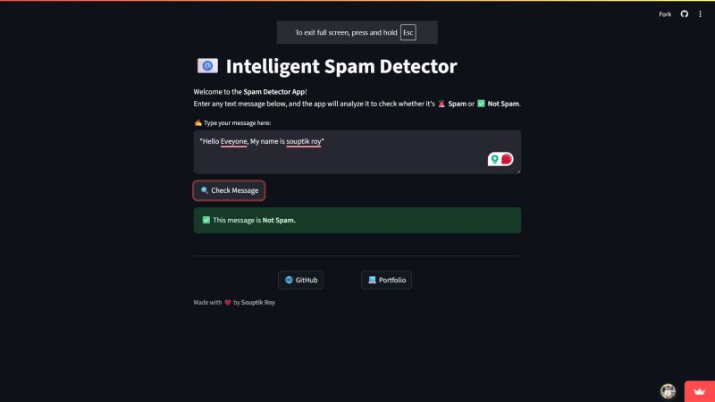

# 📧 Spam Email Checker

  

A machine learning project that classifies messages as **🚨 Spam** or **✅ HAM**, featuring a clean, fast, and user-friendly interface.

---

## 🚀 Live Model  
👉 **[Click Here to Try the App](https://spam-classifier-souptik.netlify.app/)**  

## 🌐 Portfolio  
👉 **[View My Portfolio](https://souptik-roy-portfolio.netlify.app/)**

---

## ✨ Features  
- Trains a **Naive Bayes Classifier** using an SMS spam dataset  
- Uses **CountVectorizer** for text feature extraction  
- **98% accuracy** on test data  
- Real-time prediction through a clean UI  
- Lightweight model — predictions under **1 second**  

---

## 🧑‍💻 Tech Stack

  
  
  
  
  
  
  
  

---

---

### 🚨 Spam Result  

  

### ✅ Ham Result  

  

---

## 🔮 Future Scope  

  
  
  
  
  
  

---

## 🧩 Extension Idea  
Could be extended into a **browser extension**, **WhatsApp bot**, or **email scanner** for automatic spam detection.

---
